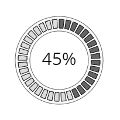

<a href="../../readme.ru.html">Главная</a> → Индикатор прогресса в виде сегментного массива

***

# SegmentArrayProgressBar

## Содержание
1. [Описание объекта](#description)  
2. [Зависимости объекта](#dependencies)  
3. [Создание объекта](#constructor)  
4. [Примеры] (#examples)  
5. [Свойства](#properties)  
6. [Методы](#methods)  
7. [События](#events)  

##Описание объекта

Индикатор прогресса – графический элемент для визуализации степени завершенности какого-либо процесса (рис. 1).

  
Рис. 1 - Индикатор прогресса в виде сегментного массива

##Зависимости объекта  
Для создания объекта типа SegmentArrayProgressBar необходимо подключить следующие скрипты:  

* segment.js  
* segment-gradient.js  
* utilities.js  

##Создание объекта  
Для создания объекта в функцию-конструктор передаются основные параметры:   
>
*id* - идентификатор индикатора прогресса в виде текстовой строки.  
*context* - контекст типа CanvasRenderingContext2D для отрисовки индикатора прогресса.  
*cx* - координата X центра базового сегмента.  
*cy* - координата Y центра базового сегмента.  
*r_in* - внутренний радиус базового сегмента.  
*thickness* - толщина базового сегмента.  
*init_angle* - начальный угол базового сегмента в градусах. Может принимать отрицательные значения. 
*angle* - угол базового сегмента в градусах.

Внешний радиус базового сегмента *r_out* будет рассчитан автоматически в процессе создания объекта.

##Примеры  
<a href="../../examples/round-progress-bar-examples.html" target="_blank">Примеры</a> использования различных свойств и методов объекта.  

##Свойства
>
*min_value* - минимальное значение показателя прогресса.  
*max_value* - максимальное значение показателя прогресса.  
*value* - текущее значение показателя прогресса.  
*speed* - скорость изменения показателя прогресса при его программном изменении.  

*active_index* - индекс последнего активного сегмента индикатора прогресса.  

Индикатор прогресса в виде сегментного массива - это составной объект. В его состав входят:  
>
*base_segment* - базовый сегмент.  
*segments* - массив сегментов, визуализирующий прогресс.  

### Стиль оформления базового сегмента  
>
*gradient* - градиент заливки типа <a href="segment-gradient.ru.html">SegmentGradient</a>.   
*background* - цвет заливки базового сегмента (применяется, если не задан градиент заливки).  
*border_width* - толщина границ базового сегмента.  
*border_color* - цвет границ базового сегмента.  

Границы базового сегмента могут быть заданы отдельно при прямом доступе к нему через свойство *base_segment*.

### Параметры сегментов массива  
>
*segments_count* - количество сегментов-элементов массива.  
*segment_angle* - угол сегмента массива (игнорируется, если установлен флаг пропорциональности).  
*segment_thickness* - толщина сегмента массива.  
*segment_position* - позиция сегментов массива. Допустимые значения параметра:  
>> _"inner"_ - примыкание к внутренней границе базового сегмента.  
>> _"middle"_ - расположение по середине базового сегмента.  
>> _"outer"_ - примыкание к внешней границе базового сегмента.  
>
*segment_r_in* - внутренний радиус сегмента массива. Игнорируется, если задано свойство *segment_position*.  
*start_with* - начать размещение объектов на базовом сегменте массива с сегмента или с пустого пространства. Допустимые значения параметра:  
>> _"segment"_ - начать с сегмента.  
>> _"space"_ - начать с пустого пространства.  

### Стиль оформления сегментов массива  
> *segment_gradient* - градиент заливки сегментов массива. Значение типа <a href="segment-gradient.ru.html">SegmentGradient</a>.  
> *segment_background* - цвет заливки сегментов массива (применяется, если не задан градиент заливки).  
> *segment_border_width* - толщина границ сегментов массива.  
> *segment_border_color* - цвет границ сегментов массива.  

### Стиль оформления активных сегментов массива  
> *active_segment_gradient* - градиент заливки активных сегментов массива. Значение типа <a href="segment-gradient.ru.html">SegmentGradient</a>.  
> *active_segment_background* - цвет заливки активных сегментов массива (применяется, если не задан градиент заливки).  
> *active_segment_border_width* - толщина границ активных сегментов массива.  
> *active_segment_border_color* - цвет границ активных сегментов массива.  

### Стиль оформления текстового индикатора прогресса  
В центре объекта располагается текстовая надпись, содержащая числовое представление степени завершенности процесса.  
Текст надписи формируется из значения параметра *value* и единиц измерения *units*.  
>
*font* - шрифт надписи.  
*text_color* - цвет надписи.  
*text_border_width* - толщина границ текста надписи.  
*text_border_color* - цвет границ текста надписи.  
*units* - единицы измерения.  

### Флаги объекта
>
*full_thickness* - полная толщина. Значение *true* обеспечивает одинаковую толщину сегментов индикатора прогресса и базового сегмента.  
*visible* - видимость. Значение *true* обеспечивает видимость объекта.  
*segments_visible* - видимость сегментов индикатора прогресса.  
*in_progress* - в процессе. Флаг принимает значение *true* в процессе анимации.  

##Методы

> *build()* - выполняет основные вычисления формы и внешнего вида объекта с учетом заданных свойств и флагов.
Этот метод необходимо вызывать после изменения свойств объекта, чтобы они вступили в силу.  

> *draw()* - функция отрисовки сегмента.  

> *instanceCopy()* - создание независимой копии объекта.  

> *valueToActiveIndex(value)* - функция вычисления активного индекса индикатора прогресса в зависимости от текущего значения завершенности процесса.  

> *changeValue(value, speed, delay)* - анимация изменения текущего значения завершенности процесса на *value* со скоростью *speed* и задержкой *delay*.  

## События

События, запускаемые объектом SegmentArrayProgressBar, реализованы с помощью CustomEvent.  
В поле *detail.progress_bar* передается ссылка на сам объект.  

> *segment-array-progress-bar-changed* - состояние объекта изменено.  

***

<a href="../../readme.ru.html">Главная</a> → Индикатор прогресса в виде сегментного массива
