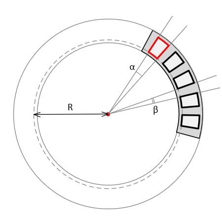

<a href="../../readme.ru.html">Главная</a> → Массив сегментов

***

# SegmentArray

## Содержание
1. [Описание объекта](#description)  
2. [Зависимости объекта](#dependencies)  
3. [Создание объекта](#constructor)  
4. [Примеры] (#examples)  
5. [Свойства](#properties)  
6. [Методы](#methods)  
7. [События](#events)  

##Описание объекта

Сегментный массив – это массив сегментов, имеющих единый центр и расположенных по дуге окружности на одинаковом расстоянии друг от друга (рис. 1).

  
рис. 1 - Геометрия массива сегментов.

R - внутренний радиус сегментов массива.  
α - угол сегмента массива.  
β - угол между сегментами массива.  

##Зависимости объекта  
Для создания объекта типа SegmentArray необходимо подключить следующие скрипты:  

* segment.js  
* segment-gradient.js  
* utilities.js  

##Создание объекта  
Для создания массива сегментов в функцию-конструктор передаются основные параметры, которые используются для создания базового, или опорного, сегмента:
>
*id* - идентификатор массива сегментов в виде текстовой строки.  
*context* - контекст типа CanvasRenderingContext2D для отрисовки массива сегментов.  
*cx* - координата X центра базового сегмента.  
*cy* - координата Y центра базового сегмента.  
*r_in* - внутренний радиус базового сегмента.  
*thickness* - толщина базового сегмента.  
*init_angle* - начальный угол базового сегмента в градусах. Может принимать отрицательные значения. 
*angle* - угол базового сегмента в градусах.

##Примеры  
<a href="../../examples/segment-array-examples.html" target="_blank">Примеры</a> использования различных свойств и методов объекта.  

##Свойства

### Стиль оформления базового сегмента  
>
*gradient* - градиент заливки типа <a href="segment-gradient.ru.html">SegmentGradient</a>.   
*background* - цвет заливки базового сегмента (применяется, если не задан градиент заливки).  
*border_width* - толщина границ базового сегмента.  
*border_color* - цвет границ базового сегмента.  

Границы базового сегмента могут быть заданы отдельно при прямом доступе к нему через свойство *base_segment*.

### Параметры элементов массива  
>
*segments_count* - количество сегментов-элементов массива.  
*segment_angle* - угол сегмента массива (игнорируется, если установлен флаг пропорциональности).  
*segment_thickness* - толщина сегмента массива.  
*segment_position* - позиция сегментов массива. Допустимые значения параметра:  
>> _"inner"_ - примыкание к внутренней границе базового сегмента.  
>> _"middle"_ - расположение по середине базового сегмента.  
>> _"outer"_ - примыкание к внешней границе базового сегмента.  
>
*segment_r_in* - внутренний радиус сегмента массива. Игнорируется, если задано свойство *segment_position*.  
*start_with* - начать размещение объектов на базовом сегменте массива с сегмента или с пустого пространства. Допустимые значения параметра:  
>> _"segment"_ - начать с сегмента.  
>> _"space"_ - начать с пустого пространства.  

### Стиль оформления элементов массива
> *segment_gradient* - градиент заливки сегментов массива. Значение типа <a href="segment-gradient.ru.html">SegmentGradient</a>.  
> *segment_background* - цвет заливки сегментов массива (применяется, если не задан градиент заливки).  
> *segment_border_width* - толщина границ сегментов массива.  
> *segment_border_color* - цвет границ сегментов массива.  

### Флаги массива
>
*proportional* - пропорциональность. Значение *true* обеспечивает одинаковые углы для элементов массива и расстояний между ними.  
*full_thickness* - полная толщина. Значение *true* обеспечивает одинаковую толщину элемента массива и базового сегмента.  
*visible* - видимость. Значение *true* обеспечивает видимость объекта.  
*segments_visible* - видимость сегментов. Значение *true* обеспечивает видимость элементо вмассива.  
*in_progress* - в процессе. Флаг принимает значение *true* в процессе анимации.

##Методы

> *build()* - выполняет основные вычисления формы и внешнего вида базового сегмента и элементов массива с учетом заданных свойств и флагов.

> *draw()* - функция отрисовки объекта.  

> *instanceCopy()* - создание независимой копии объекта.  

### Анимация массива сегментов

Анимация сегментного массива - это различные изменения формы, положения или стиля оформления сегментов массива со временем.

Основные параметры анимации:
> *duration* - длительность анимации. Задается в секундах.  
> *delay* - задержка перед началом анимации. Задается в секундах.   
> *direction* - направление анимации. Набор допустимых значений зависит от вида анимации.  
> *order* - порядок анимации. Допустимые значения:  
>> _"together"_ - вместе.
>> _"one-by-one-clockwise"_ - один за другим по часовой стрелке.  
>> _"one-by-one-anticlockwise"_ - один за другим против часовой стрелки.  
>> Для поочередной анимации длительность *duration* будет разделена равномерно между элементами массива с учетом задержки между анимацией элементов.

> *lag* - задержка между анимацией элементов массива. Задается в секундах.  

#### Методы анимации

> *appear(order, lag, direction, duration, delay)* - появление сегментов массива за счет постепенного изменения их формы.  
>> Параметр *direction* может принимать значения, допустимые для аналогичного метода объекта <a href="segment.ru.html">Segment</a>.  
Если все сегменты массива появились, то запускается событие *segment-array-appeared*.

> *disappear(direction, duration, delay)* - исчезание сегментов массива за счет постепенного изменения их формы.  
>> Параметр *direction* может принимать значения, допустимые для аналогичного метода объекта <a href="segment.ru.html">Segment</a>.  
Если все сегменты массива исчезли, то запускается событие *segment-array-disappeared*.

> *fadeIn(order, lag, duration, delay)* - появление сегментов массива за счет постепенного изменения их прозрачности.  
>> Если все сегменты массива выцвели, то запускается событие *segment-array-faded-in*.  

> *fadeOut(order, lag, duration, delay)* - исчезание сегментов массива за счет постепенного изменения их прозрачности.
>> Если все сегменты массива выцвели, то запускается событие *segment-array-faded-out*.  

## События

События, запускаемые объектом SegmentArray, реализованы с помощью CustomEvent.  
В параметре *detail.array* передается ссылка на сам объект.

> *segment-array-changed* - объект изменен. Событие запускается, если изменен один из элементов массива или базовый сегмент.  

> *segment-array-appeared* - все элементы массива появились.  
> *segment-array-disappeared* - все элементы массив исчезли.  
> *segment-array-faded-in* - все элементы массива появились выцветанием.  
> *segment-array-faded-out* - все элементы массива исчезли выцветанием.  

***

<a href="../../readme.ru.html">Главная</a> → Массив сегментов  