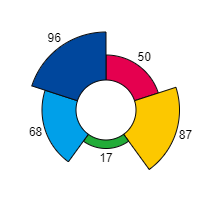

<a href="../../readme.ru.html">Главная</a> → Круговая диаграмма

***

# SegmentChart

## Содержание
1. [Описание объекта](#description)  
2. [Зависимости объекта](#dependencies)  
3. [Создание объекта](#constructor)  
4. [Примеры] (#examples)  
5. [Свойства](#properties)  
6. [Методы](#methods)  
7. [События](#events)  

##Описание объекта

Круговая диаграмма – графическое представление данных с помощью сегментов, позволяющее быстро оценить соотношение нескольких величин (рис. 1).

  
рис. 1 - Круговые диаграммы типов "pie", "radial", "bar" слева направо.

##Зависимости объекта  
Для создания объекта типа SegmentChart необходимо подключить следующие скрипты:  

* segment.js  
* segmment-scale-sign.js  
* segment-gradient.js  
* utilities.js  

##Создание объекта  
Для создания круговой диаграммы в функцию-конструктор передаются основные параметры:
>
*id* - идентификатор диаграммы в виде текстовой строки.  
*context* - контекст типа CanvasRenderingContext2D для отрисовки диаграммы.  
*cx* - координата X центра диаграммы.  
*cy* - координата Y центра диаграммы.  
*r_in* - внутренний радиус диаграммы. При нулевом значении диаграмма строится на основе круга.  
*thickness* - толщина диаграммы.  
*init_angle* - начальный угол базового сегмента в градусах. По умолчанию -90 градусов.  
*angle* - угол базового сегмента в градусах. По умолчанию 360 градусов.  

##Примеры  
<a href="../../examples/round-chart-examples.html" target="_blank">Примеры</a> использования различных свойств и методов объекта.  

##Свойства

> *type* - тип диаграммы. Допустимые значения для параметра:  
>> _"pie"_ - пирог.  
>> _"radial"_ - радиальная.  
>> _"bar"_ - гистограмма.  

> *source* - источник даннных диаграммы. Источник данных задается в виде массива, объектами которого являются массивы данных:  
>>[название, значение, цвет].  

> *data* - массив значений, полученных из источника данных.  

> *min_value* - минимальное значение ряда данных.  
> *max_value* - максимальное значение ряда данных.  
> *total* - суммарное значение ряда данных.  

>
*sign_r_in* - внутренний радиус подписей.  
*sign_r_offset* - радиальное смещение подписей.  
*font* - шрифт подписей.  
*text_color* - цвет текста подписей.  
*text_border_width* - толщина границы текста подписей.  
*text_border_color* - цвет границы текста подписей.  
*text_direction* - направление текста подписей. Допустимые значения параметра:  
>> _"vertical"_ - вертикально относительно холста.  
>> _"clockwise"_ - по часовой стрелке.  
>> _"anticlockwise"_ - против часовой стрелки.  
>> _"from-center"_ - от центра.  
>> _"to-center"_ - к центру.  

### Стиль оформления базового сегмента  
>
*gradient* - градиент заливки типа <a href="segment-gradient.ru.html">SegmentGradient</a>.   
*background* - цвет заливки базового сегмента (применяется, если не задан градиент заливки).  
*border_width* - толщина границ базового сегмента.  
*border_color* - цвет границ базового сегмента.  

Границы базового сегмента могут быть заданы отдельно при прямом доступе к нему через свойство *base_segment*.

### Параметры элементов массива  
>
*segments_count* - количество сегментов-элементов массива.  
*segment_angle* - угол сегмента массива (игнорируется, если установлен флаг пропорциональности).  
*segment_thickness* - толщина сегмента массива.  
*segment_position* - позиция сегментов массива. Допустимые значения параметра:  
>> _"inner"_ - примыкание к внутренней границе базового сегмента.  
>> _"middle"_ - расположение по середине базового сегмента.  
>> _"outer"_ - примыкание к внешней границе базового сегмента.  
>
*segment_r_in* - внутренний радиус сегмента массива. Игнорируется, если задано свойство *segment_position*.  
*start_with* - начать размещение объектов на базовом сегменте массива с сегмента или с пустого пространства. Допустимые значения параметра:  
>> _"segment"_ - начать с сегмента.  
>> _"space"_ - начать с пустого пространства.  

>
*space_angle* - угол пространства между сегментами.  
*space_thickness* - толщина пространства между сегментами.  

### Стиль оформления элементов массива
> *segment_gradient* - градиент заливки сегментов массива. Значение типа <a href="segment-gradient.ru.html">SegmentGradient</a>.  
> *segment_background* - цвет заливки сегментов массива (применяется, если не задан градиент заливки).  
> *segment_border_width* - толщина границ сегментов массива.  
> *segment_border_color* - цвет границ сегментов массива.  

### Флаги массива
>
*proportional* - пропорциональность. Значение *true* обеспечивает одинаковые углы для элементов массива и расстояний между ними.  
*full_thickness* - полная толщина. Значение *true* обеспечивает одинаковую толщину элемента массива и базового сегмента.  
*visible* - видимость. Значение *true* обеспечивает видимость объекта.  
*segments_visible* - видимость сегментов. Значение *true* обеспечивает видимость элементо вмассива.  
*signs_visible* - видимость легенды.  
*in_progress* - в процессе. Флаг принимает значение *true* в процессе анимации.

##Методы

> *build()* - выполняет основные вычисления формы и внешнего вида диаграммы с учетом заданных свойств и флагов.  

> *draw()* - функция отрисовки объекта.  

> *instanceCopy()* - создание независимой копии объекта.  

## События

События, запускаемые объектом SegmentChart, реализованы с помощью CustomEvent.  
В параметре *detail.chart* передается ссылка на сам объект.

> *segment-chart-changed* - объект изменен. Событие запускается, если изменен один из элементов массива или базовый сегмент.  

> *segment-chart-appeared* - все сегменты диаграммы появились.  
> *segment-chart-disappeared* - все сегменты диаграммы исчезли.  
> *segment-chart-faded-in* - все сегменты диаграммы появились методом выцветания.  
> *segment-chart-faded-out* - все сегменты диаграммы исчезли методом выцветания.  

***

<a href="../../readme.ru.html">Главная</a> → Круговая диаграмма  