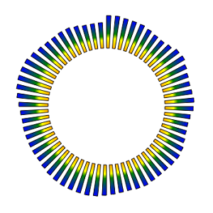

<a href="../../readme.ru.html">Главная</a> → Круговой эквалайзер

***

# SegmentEqualizer

## Содержание
1. [Описание объекта](#description)  
2. [Зависимости объекта](#dependencies)  
3. [Создание объекта](#constructor)  
4. [Примеры] (#examples)  
5. [Свойства](#properties)  
6. [Методы](#methods)  
7. [События](#events)  

##Описание объекта

Круговой эквалайзер – графический элемент для визуализации амплитуды сигнала в зависимости от частотных характеристик (рис. 1).

  
рис. 1 - Сегментный эквалайзер.

##Зависимости объекта  
Для создания объекта типа SegmentEqualizer необходимо подключить следующие скрипты:  

* segment.js  
* segment-gradient.js  
* utilities.js  

##Создание объекта  
Для создания массива сегментов в функцию-конструктор передаются основные параметры, которые используются для создания базового, или опорного, сегмента:
>
*id* - идентификатор эквалайзера в виде текстовой строки.  
*context* - контекст типа CanvasRenderingContext2D для отрисовки объекта.  
*cx* - координата X центра базового сегмента.  
*cy* - координата Y центра базового сегмента.  
*r_in* - внутренний радиус базового сегмента.  
*thickness* - толщина базового сегмента.  
*init_angle* - начальный угол базового сегмента в градусах. Может принимать отрицательные значения. 
*angle* - угол базового сегмента в градусах.

##Примеры  
<a href="../../examples/round-equalizer-examples.html" target="_blank">Примеры</a> использования различных свойств и методов объекта.  

##Свойства
>
*values* - массив коэффициентов в диапазоне [-1; 1], определяющих форму волны.  
Для визуализациии формы волны коэффициенты применяется к толщине сегментов массива.  

### Стиль оформления базового сегмента  
>
*gradient* - градиент заливки типа <a href="segment-gradient.ru.html">SegmentGradient</a>.   
*background* - цвет заливки (применяется, если не задан градиент заливки).  
*border_width* - толщина границ.  
*border_color* - цвет границ.  

Границы базового сегмента могут быть заданы отдельно при прямом доступе к нему через свойство *base_segment*.

### Параметры элементов массива  
>
*segments_count* - количество сегментов-элементов массива.  
*segment_angle* - угол сегмента массива (игнорируется, если установлен флаг пропорциональности).  
*segment_thickness* - толщина сегмента массива.  
*segment_position* - позиция сегментов массива. Допустимые значения параметра:  
>> _"inner"_ - примыкание к внутренней границе базового сегмента.  
>> _"middle"_ - расположение по середине базового сегмента.  
>> _"outer"_ - примыкание к внешней границе базового сегмента.  
>
*segment_r_in* - внутренний радиус сегмента массива. Игнорируется, если задано свойство *segment_position*.  
*start_with* - начать размещение объектов на базовом сегменте массива с сегмента или с пустого пространства. Допустимые значения параметра:  
>> _"segment"_ - начать с сегмента.  
>> _"space"_ - начать с пустого пространства.  

### Стиль оформления элементов массива
> *segment_gradient* - градиент заливки сегментов массива. Значение типа <a href="segment-gradient.ru.html">SegmentGradient</a>.  
> *segment_background* - цвет заливки сегментов массива (применяется, если не задан градиент заливки).  
> *segment_border_width* - толщина границ сегментов массива.  
> *segment_border_color* - цвет границ сегментов массива.  

### Флаги массива
>
*proportional* - пропорциональность. Значение *true* обеспечивает одинаковые углы для элементов массива и расстояний между ними.  
*full_thickness* - полная толщина. Значение *true* обеспечивает одинаковую толщину элемента массива и базового сегмента.  
*visible* - видимость. Значение *true* обеспечивает видимость объекта.  
*segments_visible* - видимость сегментов. Значение *true* обеспечивает видимость элементо вмассива.  
*in_progress* - в процессе. Флаг принимает значение *true* в процессе анимации.

##Методы

> *build()* - выполняет основные вычисления формы и внешнего вида базового сегмента и элементов массива с учетом заданных свойств и флагов.

> *draw()* - функция отрисовки объекта.  

> *instanceCopy()* - создание независимой копии объекта.  

> *changeValues(values, speed, delay)* - функция применения новых коэффициентов *values*, определяющих форму волны, со скоростью *speed* и задержкой *delay*.   

## События

События, запускаемые объектом SegmentEqualizer, реализованы с помощью CustomEvent.  
В параметре *detail.equalizer* передается ссылка на сам объект.

> *segment-equalizer-changed* - объект изменен. Событие запускается, если изменен один из элементов массива или базовый сегмент.  

***

<a href="../../readme.ru.html">Главная</a> → Круговой эквалайзер  
