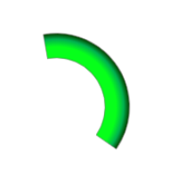

<a href="../../readme.ru.html">Главная</a> → Сегментный градиент

***

# SegmentGradient

## Содержание
1. [Описание объекта](#description)  
2. [Зависимости объекта](#dependencies)  
3. [Создание объекта](#constructor)  

##Описание объекта

Сегментный градиент – пользовательский градиент для заливки элементов круговых интерфейсов.  

##Зависимости объекта  
Для создания объекта типа SegmentGauge необходимо подключить следующие скрипты:  

* utilities.js  

##Создание объекта  

Для создания пользовательского градиента в функцию-конструктор передаются следующие параметры:  
> *type* - тип градиента. Допустимые значения:  
>> _"linear"_ - линейный градиент.  
>> _"radial"_ - радиальный градиент.  
>> _"conic"_ - конический градиент.  

> *direction* - направление градиента. Набор допустимых значений зависит от типа градиента и типа объекта заливки.  

> *stops_string* - строка, задающая позицию каждого цвета через точки остановки.  
Цвет может быть задан в виде ключевого слова, в формате HEX(RGB), в формате RGB или RGBA.  
Точка остановки задается в процентах.  
Цвет и точка разделяются пробелом.  
Пары цвет-точка в строке разделяются запятыми.  

Пример радиального пользовательского градиента, исходящего из центра сегмента (рис. 1):
>
CustomGradient('radial', 'from-center', '#06ff1a 45%, #00b050 76%, #034400 98%')  

  
Рис. 1 - Сегментный градиент

***

<a href="../../readme.ru.html">Главная</a> → Сегментный градиент  