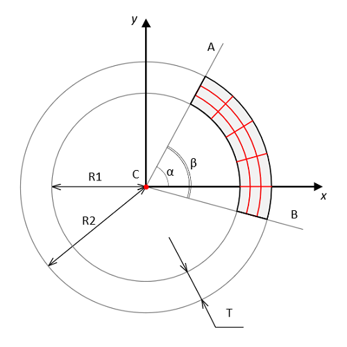

<a href="../../readme.ru.html">Главная</a> → Сегментная сетка  

***

# SegmentGrid

## Содержание
1. [Описание объекта](#description)  
2. [Зависимости объекта](#dependencies)
3. [Создание объекта](#constructor)  
4. [Примеры] (#examples)  
5. [Свойства](#properties)  
6. [Методы](#methods)  
7. [События](#events)  

##Описание объекта

Сегментная сетка – сетка, составленная из концентрических дуг, отстоящих друг от друга на одинаковом расстояниии, и отрезков лучей, исходящих из центра сегмента (рис. 1).

  
Рис. 1 - Геометрия сегментной сетки

C - центр базового сегмента.  
R1 - радиус меньшей окружности базового сегмента.  
R2 - радиус большей окружности базового сегмента.  
CA - луч, ограничивающий базовый сегмент и определяющий его начало.  
CB - луч, ограничивающий базовый сегмент и определяющий его конец.  
T - толщина базового сегмента, равная разнице между R2 и R1.  
α - начальный угол базового сегмента - это угол между горизонтальной осью X и лучом CA.  
β - угол базового сегмент - это угол между лучами CA и CB.  

##Зависимости объекта  
Объект SegmentGrid наследуется от объекта Segment.  
Для создания объекта типа SegmentGrid необходимо подключить следующие скрипты:  

* segment.js  
* segment-gradient.js  
* utilitites.js  

##Создание объекта  
Для создания объекта в функцию-конструктор передаются основные параметры:   
>
*id* - идентификатор сегмента в виде текстовой строки.  
*context* - контекст типа CanvasRenderingContext2D для отрисовки сегмента.  
*cx* - координата X центра сегмента.  
*cy* - координата Y центра сегмента.  
*r_in* - внутренний радиус сегмента.  
*thickness* - толщина сегмента.  
*init_angle* - начальный угол сегмента в градусах. Может принимать отрицательные значения. 
*angle* - угол сегмента в градусах.

Внешний радиус сегмента *r_out* будет рассчитан автоматически в процессе создания объекта.

##Примеры  
<a href="../../examples/round-radar-examples.html" target="_blank">Примеры</a> использования различных свойств и методов объекта.  

##Свойства

Объект SegmentGrid наследует свойства объекта Segment и обладает собственнными свойствами:  
>
*circles_count* - количество концентрических дуг в сетке.  
*circle_pitch* - шаг дуг сетки (расчитывается автоматически).  
*circle_width* - толщина дуг сетки.  
*circle_color* - цвет дуг сетки.  

>
*beams_count* - количество лучей в сетке.  
*beam_pitch* - шаг лучей сетки (расчитывается автоматические в градусах).  
*beam_width* - толщина лучей сетки.  
*beam_color* - цвет лучей сетки.  

### Флаги сетки
>
*visible* - видимость. Значение *true* обеспечивает видимость объекта.  
*circles_visible* - видимость концентрических дуг сетки.  
*beams_visible* - видимость лучей сетки.  
*in_progress* - в процессе. Флаг принимает значение *true* в процессе анимации.  

##Методы

Объект SegmentGrid наследует методы объекта Segment.  

## События

Объект SegmentGrid наследует события объекта Segment.  

***

<a href="../../readme.ru.html">Главная</a> → Сегментная сетка  