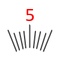

<a href="../../readme.ru.html">Главная</a> → Знак сегментной шкалы

***

# SegmentScaleSign

## Содержание
1. [Описание объекта](#description)  
2. [Зависимости объекта](#dependencies)  
3. [Создание объекта](#constructor)  
4. [Свойства](#properties)  
5. [Методы](#methods)  
6. [События](#events)  

##Описание объекта

Знак сегментной шкалы – знак на шкале (символ, подпись), соответствующий некоторому измеряемому значению (рис. 1).  
SegmentScaleSign - вспомогательный класс библиотеки круговых интерфейсов для реализации сегментной шкалы.  

  
Рис. 1 - Знак сегментной шкалы

##Зависимости объекта  
Для создания объекта типа SegmentScaleSign необходимо подключить следующие скрипты:  

* utilities.js  

##Создание объекта  
Для создания объекта в функцию-конструктор передаются основные параметры:   
>
*id* - идентификатор подписи в виде текстовой строки.  
*context* - контекст типа CanvasRenderingContext2D для отрисовки подписи.  
*cx* - координата X центра сегментной шкалы.  
*cy* - координата Y центра сегментной шкалы.  
*r_in* - внутренний радиус подписи.  
*text* - текст подписи.  
*angle* - угол подписи в градусах.  

##Свойства

### Стиль оформления подписи  
>
*font* - шрифт подписи.  
*text_color* - цвет текста.  
*text_border_width* - толщина границы текста подписи.  
*text_border_color* - цвет границы текста подписи.  
*text_direction* - направление текста.  
>> Допустимые значения параметра *text_direction*:  
>> _"vertical"_ - вертикально относительно холста.  
>> _"clockwise"_ - по часовой стрелке.  
>> _"anticlockwise"_ - против часовой стрекли.  
>> _"from-center"_ - от центра.  
>> _"to-center"_ - к центру.  

### Флаги подписи  
>
*visible* - видимость. Значение *true* обеспечивает видимость объекта.  
*in_progress* - в процессе. Флаг принимает значение *true* в процессе анимации.  

##Методы

> *calc()* - выполняет основные вычисления формы и внешнего вида подписис при ее создании, изменении параметров и в процессе анимации.  
Этот метод необходимо вызывать после изменения свойств объекта, чтобы они вступили в силу.  

> *draw()* - функция отрисовки подписи.  

> *instanceCopy()* - создание независимой копии объекта.

### Анимация отметки

Анимация знака - это различные изменения формы, положения или стиля оформления подписи шкалы со временем.  

Основные параметры анимации:
> *duration* - длительность анимации. Задается в секундах.  
> *delay* - задержка перед началом анимации. Задается в секундах.   
> *direction* - направление анимации. Набор допустимых значений зависит от вида анимации.  

#### Методы анимации

> *appear(direction, duration, delay)* - появление подписи за счет постепенного изменения формы.  
>> Допустимые значения параметра *direction* для метода анимации появления:  
>> _"from-center"_ - от центра базового сегмента шкалы.  
>> _"to-center"_ - к центру базового сегмента шкалы.  
>> _"from-middle"_ - из середины подписи.  

> *disappear(direction, duration, delay)* - исчезание подписи за счет постепенного изменения формы.  
>> Допустимые значения параметра *direction* для метода анимации исчезания:  
>> _"from-center"_ - от центра базового сегмента шкалы.  
>> _"to-center"_ - к центру базового сегмента шкалы.  
>> _"to-middle"_ - к середине подписи.    

> *fadeIn(duration, delay)* - постепенное появление подписи за счет изменения прозрачности.  

> *fadeOut(duration, delay)* - постепенное исчезание подписи за счет изменения прозрачности.

## События

События, запускаемые объектом SegmentScaleSign, реализованы с помощью CustomEvent.  
В поле *detail.sign* передается ссылка на сам объект.  

> *segment-scale-sign-changed* - подпись сегментной шкалы изменена. Событие запускается каждый раз, когда выполняется метод calc().  

> *segment-scale-sign-appeared* - подпись появилась.  
> *segment-scale-sign-disappeared* - подпись исчезла.  
> *segment-scale-sign-faded-in* - подпись появилась методом выцветания.  
> *segment-scale-sign-faded-out* - подпись исчезла методом выцветания.  

***

<a href="../../readme.ru.html">Главная</a> → Знак сегментной шкалы  
