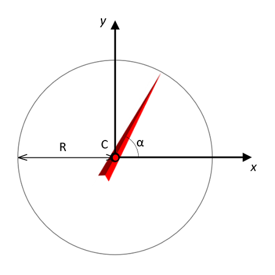
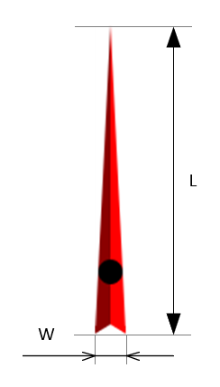

<a href="../readme.html">Home</a> → Segment Arrow  

***

# SegmentArrow

## Contents
1. [Object description](#description)  
2. [Object dependencies](#dependencies)
3. [Object creation](#constructor)  
4. [Examples] (#examples)  
5. [Properties](#properties)  
6. [Methods](#methods)  
7. [Events](#events)  

##Object description

Arrow is an auxiliary graphic object for the implementation of "<a href="segment-gauge.html">Gauge</a>" (Fig. 1).  

  
Fig. 1 - SegmentArrow

C - the anchor point of the arrow - is the center of the circle of the arrow rotation.  
R - circle radius.  
α - arrow angle.  

The arrow has length and width (Fig. 2).

L - length of arrow image.  
W - width of arrow image.  

  
Fig. 2 - Arrow Geometry  

##Object dependencies  
The following scripts should be included in the \<head> section:  

* utilities.js  

##Object creation  
To create an object, the main parameters are passed to the constructor function:   
>
*id* - arrow identificator as a text string.  
*context* - CanvasRenderingContext2D for drawing the arrow.  
*cx* - X coordinate of the circle center.  
*cy* - Y coordinate of the circle center.  
*width* - arrow width.  
*length* - arrow length.  
*angle* - the angle of deviation of the arrow from the horizontal axis in degrees.  

##Examples  
<a href="../examples/round-gauge-examples.html" target="_blank">Examples</a> of using various properties and methods of the object.  

##Properties

### Arrow Style  
>
*img* - the image that represents the arrow.  
*img_src* - path to the arrow image.  
*img_angle* - angle of deviation of the image from the horizontal axis in degrees. For example, if the arrow in the image is directed vertically upwards, then the *img_angle* should be set to -90°.  
*img_offset_x* - offset of the image along the X axis to bring the anchor point of the arrow to the center of the circle.  
*img_offset_y* - offset of the image along the Y axis to bring the anchor point of the arrow to the center of the circle.  

### Object Flags
>
*visible* - flag ensures the visibility of the object if set in *true*.  
*in_progress* - flag takes the value *true* during the animation.  

##Methods

> *calc()* - performs basic calculations of the shape and style of a segment when it is created, changed and during animation.  
This method should be called after changing the properties of the object so that they take effect.  

> *setImgSrc(path)* - sets the path to the arrow image and binds the *calc()* method to the image load event.  

> *draw()* - draws an object.  

> *instanceCopy()* - creates an independent copy of the object.

***

<a href="../readme.html">Home</a> → Segment Arrow  