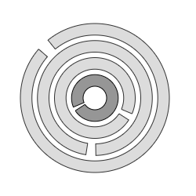

<a href="../readme.html">Home</a> → Segment Captcha

***

# SegmentCaptcha

## Contents
1. [Object description](#description)  
2. [Object dependencies](#dependencies)
3. [Object creation](#constructor)  
4. [Examples] (#examples)  
5. [Properties](#properties)  
6. [Methods](#methods)  
7. [Events](#events)  

##Object description

Segment CAPTCHA test is a computer test in which the user should match the breaks of the rings.
Since this task is non-trivial for a computer, solving it the user proves that he or she is a human being, not a computer (Fig. 1).  

  
Fig. 1 - Segment Captcha.  

One of the rings, the base one, is static and cannot be rotated with the mouse. This ring should be styled differently from other rings.  
To solve the task, the user must combine the breaks of the remaining rings with the break of the base ring.  
The ring is captured by clicking and holding the left mouse button.  
The ring is rotated by moving the mouse cursor.  

##Object dependencies  
The following scripts should be included in the \<head> section:  

* segment.js  
* segment-gradient.js  
* utilities.js  

##Object creation  
To create an object, the main parameters are passed to the constructor function. These parameters are used to create the base segment:  
>
*id* - captcha identificator as a text string.  
*context* - CanvasRenderingContext2D for drawing the object.  
*cx* - X coordinate of the base segment center.  
*cy* - Y coordinate of the base segment center.  
*r_in* - object inner radius.  
*thickness* - thickness of the object.  

##Examples  
<a href="../examples/round-captcha-examples.html" target="_blank">Examples</a> of using various properties and methods of the object.  

##Properties
>
*space_thickness* - thickness of spaces between rings.  
*precision* - alignment accuracy of ring breaks in degrees.  

### Base Ring Style  
>
*base_segment_gradient* - fill gradient. Type of value is <a href="segment-gradient.html">SegmentGradient</a>.  
*base_segment_background* - fill color (applies if fill gradient is not specified).  
*base_segment_border_width* - base segment border width.  
*base_segment_border_color* - base segment border color.
*base_segment_position* - base ring position.  

>>Valid "base_segment_position" values:  
>> _"inner"_ - the base is the inner ring.  
>> _"outer"_ - the base is the outer ring.  

>
The borders of the base segment can be set separately using direct access to it through the *base_segment* property.  

### Free rings properties  
>
*segments_count* - total number of rings.  
*segment_break* - ring break in degrees.  

### Free Rings Style  
> *segment_gradient* - segments fill gradient. Type of value is <a href="segment-gradient.html">SegmentGradient</a>.  
> *segment_background* - segments fill color (applies if fill gradient is not specified).  
> *segment_border_width* - segments border width.  
> *segment_border_color* - segments border color.  

### Object Flags  
>
*proportional* - value *true* ensures the same thickness of the rings and the spaces between them.  
*visible* - value *true* ensures object visibility.  
*segments_visible* - value *true* ensures rings visibility.  
*in_progress* - flag takes the value *true* during the animation.  

##Methods

> *build()* - performs basic calculations of the shape and style of object, taking into account the specified properties and flags.  

> *draw()* - draws an object.  

> *instanceCopy()* - creates an independent copy of the object.  

> *catchSegment(e)* - grabbing the ring by left clicking on it.  

> *rotateSegmentByMouseMovement(e)* - rotating the grabbed ring by mouse move.  

> *rotateSegmentByMouseWheel(e)* - rotating the grabbed ring by mouse wheel.  

> *releaseKnob()* - the grabbed ring is released by releasing the left mouse button.  

> *checkCaptcha()* - checking the position of all rings.  
If the breaks of all rings are aligned with sufficient "precision", then the "segment-captcha-unlocked" event is triggered.  

##Events  

Events triggered by a SegmentCaptcha are implemented using a CustomEvent.  
In the *detail.captcha* field, a link to the object itself is passed.  

> *segment-knob-changed* - state of the object is changed.  

***

<a href="../readme.html">Home</a> → Segment Captcha  