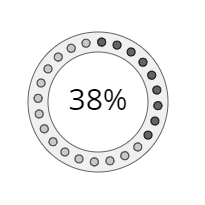

<a href="../readme.html">Home</a> → Segment Dots Array Progress Bar

***

# SegmentDotsArrayProgressBar

## Contents
1. [Object description](#description)  
2. [Object dependencies](#dependencies)
3. [Object creation](#constructor)  
4. [Examples] (#examples)  
5. [Properties](#properties)  
6. [Methods](#methods)  
7. [Events](#events)  

##Object description  

Progress Bar is a graphic element for visualizing the degree of completion of a process (Fig. 1).  

  
Fig. 1 - Progress bar in the form of segment dots array

##Object dependencies  
The following scripts should be included in the \<head> section:  

* segment.js  
* segment-dot.js  
* segment-gradient.js  
* utilities.js  

##Object creation  
To create an object, the main parameters are passed to the constructor function:  
>
*id* - progress bar identificator as a text string.  
*context* - CanvasRenderingContext2D for drawing a progress bar.  
*cx* - X coordinate of the base segment center.  
*cy* - Y coordinate of the base segment center.  
*r_in* - base segment inner radius.  
*thickness* - thickness of the base segment.  
*init_angle* - the initial angle of the base segment in degrees. May take negative values.  
*angle* - angle of the base segment in degrees.  

The outer radius of the base segment *r_out* will be calculated automatically during the creation of the object.  

##Examples  
<a href="../examples/round-progress-bar-examples.html" target="_blank">Examples</a> of using various properties and methods of the object.  

##Properties
>
*min_value* - minimum value of progress.  
*max_value* - maximum value of progress.  
*value* - current value of progress.  
*speed* - speed of change of the progress indicator when it is programmatically changed.  
>
*active_index* - index of the last active dot of the progress bar.  

SegmentDotsArrayProgressBar is a composite object. It includes:  
>
*base_segment* - base segment of the object.  
*dots* - array of dots visualizing progress.  

### Base Segment Style  
>
*gradient* - fill gradient. Type of value is <a href="segment-gradient.html">SegmentGradient</a>.  
*background* - fill color (applies if fill gradient is not specified).  
*border_width* - base segment border width.  
*border_color* - base segment border color.

The borders of the base segment can be set separately using direct access to it through the *base_segment* property.  

### Array Dots Parameters  
>
*dots_count* - the number of dots-elements of the array.  
*dot_angle* - angle of segment which bound the dot.  
*dot_radius* - dot radius.  
*base_radius* - radius of the base circle.  
*start_with* - start placing objects on the base segment with dot or with empty space. Valid values:  
>> _"dot"_ - start with dot.  
>> _"space"_ - start with empty space.  

### Array Dots Style
> *dot_gradient* - array dots fill gradient. Type of value is <a href="segment-gradient.html">SegmentGradient</a>.  
> *dot_background* - array dots fill color (applies if fill gradient is not specified).  
> *dot_border_width* - array dots border width.  
> *dot_border_color* - array dots border color.  

### Array Active Dots Style
> *active_dot_gradient* - array active dots fill gradient. Type of value is <a href="segment-gradient.html">SegmentGradient</a>.  
> *active_dot_background* - array active dots fill color (applies if fill gradient is not specified).  
> *active_dot_border_width* - array active dots border width.  
> *active_dot_border_color* - array active dots border color.  

### Progress Bar Text Style  
In the center of the object is a text caption containing a numerical representation of the degree of completion of the process.  
The text of the label is formed from the *value* and *units* parameters.  
>
*font* - text font.  
*text_color* - text color.  
*text_border_width* - width of the text border.  
*text_border_color* - color of the text border.  
*units* - units of the *value*.  

### Object Flags  
>
*visible* - value *true* ensures object visibility.  
*dots_visible* - value *true* ensures array dots visibility.  
*in_progress* - flag takes the value *true* during the animation.  

##Methods  

> *build()* - performs basic calculations of the shape and style of object, taking into account the specified properties and flags.  

> *draw()* - draws an object.  

> *instanceCopy()* - creates an independent copy of the object.  

> *valueToActiveIndex(value)* - the function of calculating the active index of the progress indicator depending on the current value of the process completion.  

> *changeValue(value, speed, delay)* - animation of changing the current value of the process completion to *value* with *speed* and *delay*.  

##Events  

Events triggered by a SegmentDotsArrayProgressBar are implemented using a CustomEvent.  
In the *detail.progress_bar* field, a link to the object itself is passed.  

> *segment-dots-array-progress-bar-changed* - state of the object is changed.  

***

<a href="../readme.html">Home</a> → Segment Dots Array Progress Bar  