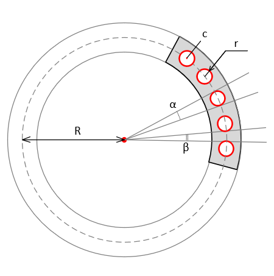

<a href="../readme.html">Home</a> → Segment Dots Array

***

# SegmentDotsArray

## Contents
1. [Object description](#description)  
2. [Object dependencies](#dependencies)
3. [Object creation](#constructor)  
4. [Examples] (#examples)  
5. [Properties](#properties)  
6. [Methods](#methods)  
7. [Events](#events)  

##Object description

Segment Dots Array is an array of <a href="segment-dot.html">dots</a> located inside the base segment along an arc of a circle at the same distance from each other (Fig. 1).

  
Fig. 1 - Segment Dots Array Geometry.  

R - radius of the base circle on which the centers of the array dots are located.  
α - angle of segment which bound the dot.  
β - angle between array dots.  
c - dot center.  
r - dot radius.  

##Object dependencies  
The following scripts should be included in the \<head> section:  

* segment.js  
* segment-dot.js  
* segment-gradient.js  
* utilities.js  

##Object creation  
To create an object, the main parameters are passed to the constructor function. These parameters are used to create the base segment:  
>
*id* - segment dots array identificator as a text string.  
*context* - CanvasRenderingContext2D for drawing a segment dots array.  
*cx* - X coordinate of the base segment center.  
*cy* - Y coordinate of the base segment center.  
*r_in* - base segment inner radius.  
*thickness* - thickness of the base segment.  
*init_angle* - the initial angle of the base segment in degrees. May take negative values. 
*angle* - angle of the base segment in degrees.

##Examples  
<a href="../examples/segment-dots-array-examples.html" target="_blank">Examples</a> of using various properties and methods of the object.  

##Properties

### Base Segment Style  
>
*gradient* - base segment fill gradient. Type of value is <a href="segment-gradient.html">SegmentGradient</a>.   
*background* - base segment fill color (applies if fill gradient is not specified).  
*border_width* - base segment border width.  
*border_color* - base segment border color.  

The borders of the base segment can be set separately using direct access to the base segment through the *base_segment* property.  

### Array Dots Parameters  
>
*dots_count* - the number of dots-elements of the array.  
*dot_angle* - angle of segment which bound the dot.  
*dot_radius* - dot radius.  
*base_radius* - radius of the base circle.  
*start_with* - start placing objects on the base segment with dot or with empty space. Valid values:  
>> _"dot"_ - start with dot.  
>> _"space"_ - start with empty space.  

### Array Dots Style
> *dot_gradient* - array dots fill gradient. Type of value is <a href="segment-gradient.html">SegmentGradient</a>.  
> *dot_background* - array dots fill color (applies if fill gradient is not specified).  
> *dot_border_width* - array dots border width.  
> *dot_border_color* - array dots border color.  

### Segment Dots Array Flags
>
*visible* - value *true* ensures object visibility.  
*segments_visible* - value *true* ensures array dots visibility.  
*in_progress* - flag takes the value *true* during the animation.

##Methods

> *build()* - performs basic calculations of the shape and style of the base segment and array elements, taking into account the specified properties and flags.  

> *draw()* - draws an object.  

> *instanceCopy()* - creates an independent copy of the object.  

### Dots Array Animation

Segment Dots Array animation is various changes in the shape, position, or style of the array dots over time.  

Key animation parameters:  
> *duration* - animation duration. Sets in seconds.  
> *delay* - delay before the start of the animation. Sets in seconds.  
> *direction* - animation direction. Valid values ​​depend on the type of animation.  
> *order* - animation order. Valid values:  
>> _"together"_.  
>> _"one-by-one-clockwise"_.  
>> _"one-by-one-anticlockwise"_.  
>> In case of *one-by-one* order the *duration* will be divided evenly between the array elements, taking into account the *lag* between animation of array elements.  

> *lag* - lag between animation of array elements. Sets in seconds.  

#### Animation Methods

> *appear(order, lag, direction, duration, delay)* - appearance of the array dots due to a gradual change in their shape.  
>> The *direction* parameter can take values ​​that are valid for a similar method of <a href="segment-dot.html">SegmentDot</a>.  
>> If all array dots appear, then the event *segment-dots-array-appeared* dispatches.  

> *disappear(direction, duration, delay)* - disappearance of the array dots due to a gradual change in their shape.  
>> The *direction* parameter can take values ​​that are valid for a similar method of <a href="segment-dot.html">SegmentDot</a>.  
>> If all array dots appear, then the event *segment-dots-array-disappeared* dispatches.

> *fadeIn(order, lag, duration, delay)* - gradual appearance of the array dots due to a change in their transparency.  
>> If all array dots appear using fading, then the event *segment-dots-array-faded-in* dispatches.  

> *fadeOut(order, lag, duration, delay)* - gradual disappearance of the array dots due to a change in their transparency.
>> If all array dots disappear using fading, then the event *segment-dots-array-faded-out* dispatches.  

##Events

Events triggered by a SegmentDotsArray are implemented using a CustomEvent.  
In the *detail.array* field, a link to the object itself is passed.  

> *segment-dots-array-changed* - event dispatches if one of the array elements or the base segment is changed.  

> *segment-dots-array-appeared*  
> *segment-dots-array-disappeared*  
> *segment-dots-array-faded-in*  
> *segment_dots_array_faded_out*  

***

<a href="../readme.html">Home</a> → Segment Dots Array  