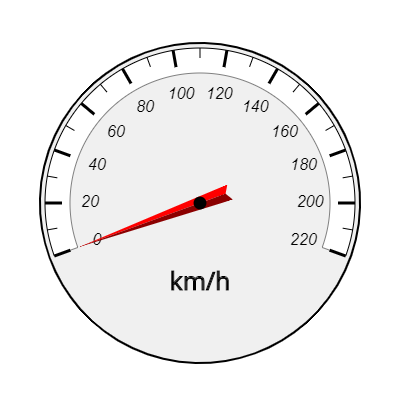

<a href="../readme.html">Home</a> → Segment Gauge

***

# SegmentGauge

## Contents
1. [Object description](#description)  
2. [Object dependencies](#dependencies)
3. [Object creation](#constructor)  
4. [Examples] (#examples)  
5. [Properties](#properties)  
6. [Methods](#methods)  
7. [Events](#events)  

##Object description  

Gauge is a composite graphical object designed to visualize the values ​​of the measured physical quantity (Fig. 1).  

  
Fig. 1 - Segment Gauge Example

##Object dependencies  
The following scripts should be included in the \<head> section:  

* segment.js  
* segment-arrow.js  
* segment-scale-mark.js  
* segment-scale-sign.js  
* segment-scale.js  
* segment-gradient.js  
* utilities.js  

##Object creation  
To create an object, the main parameters are passed to the constructor function:  
>
*id* - gauge identificator as a text string.  
*context* - CanvasRenderingContext2D for drawing the gauge.  
*cx* - X coordinate of the base segment center.  
*cy* - Y coordinate of the base segment center.  
*r_in* - base segment inner radius.  
*thickness* - thickness of the base segment.  
*init_angle* - the initial angle of the base segment in degrees. May take negative values.  
*angle* - angle of the base segment in degrees.  

##Examples  
<a href="../examples/round-gauge-examples.html" target="_blank">Examples</a> of using various properties and methods of the object.  

##Properties
>
*min_value* - minimum value of scale.  
*max_value* - maximum value of scale.    
*value* - current value of measuring parameter.  
*speed* - speed of change of the measuring parameter when it is programmatically changed.  
>
SegmentGauge is a composite object. It includes:  
>
*base_segment* - base segment of the object.  
*frame* - frame represented by a <a href="segment.html">Segment</a>.  
*scale* - scale represented by a <a href="segment-scale.html">SegmentScale</a>.  
*arrow* - arrow represented by a <a href="segment-arrow.html">SegmentArrow</a>.  

### Segment Gauge Style 
>
*base_segment_gradient* - fill gradient. Type of value is <a href="segment-gradient.html">SegmentGradient</a>.  
*base_segment_background* - fill color (applies if fill gradient is not specified).  
*base_segment_border_width* - base segment border width.  
*base_segment_border_color* - base segment border color.

>
The borders of the base segment can be set separately using direct access to it through the *base_segment* property.  

>
*frame_gradient* - fill gradient. Type of value is <a href="segment-gradient.html">SegmentGradient</a>.  
*frame_background* - fill color (applies if fill gradient is not specified).  
*frame_border_width* - border width.  
*frame_border_color* - border color.

>
*text* - a label on the device telling, for example, the unit of measurement.  
*text_offset_x* - offset of the label along the X axis relative to the center of the device.  
*text_offset_y* - offset of the label along the Y axis relative to the center of the device.  
>
*font* - label font.  
*text_color* - label color.  
*text_border_width* - text border width.  
*text_border_color* - text border color.  

### Object Flags  
>
*visible* - value *true* ensures object visibility.  
*in_progress* - flag takes the value *true* during the animation.  

##Methods  

> *build()* - performs basic calculations of the shape and style of gauge, taking into account the specified properties and flags.  

> *draw()* - draws an object.  

> *instanceCopy()* - creates an independent copy of the object.  

> *valueToAngle(value)* - function for calculating the arrow angle depending on the value of the measured parameter.  

> *setValue(value)* - function of setting the current value of the measured parameter.  

> *changeValue(value, speed, delay)* - animation of changing the current value of the measuring parameter to *value* with *speed* after *delay*.  

##Events  

Events triggered by a SegmentGauge are implemented using a CustomEvent.  
In the *detail.gauge* field, a link to the object itself is passed.  

> *segment-gauge-changed* - state of the object is changed.  

***

<a href="../readme.html">Home</a> → Segment Gauge  