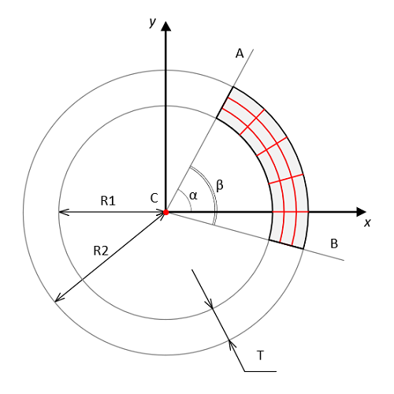

<a href="../readme.html">Home</a> → Segment Grid  

***

# SegmentGrid

## Contents
1. [Object description](#description)  
2. [Object dependencies](#dependencies)
3. [Object creation](#constructor)  
4. [Examples] (#examples)  
5. [Properties](#properties)  
6. [Methods](#methods)  
7. [Events](#events)  

##Object description

Segment grid is a grid composed of concentric arcs spaced at the same distance from each other, and segments of rays emanating from the center of the object (Fig. 1).  
  
Рис. 1 - Segment Grid Geometry  

C - base segment center.  
R1 - radius of the smaller circle.  
R2 - radius of the larger circle.  
CA - ray, bounding the base segment and determining its beginning.  
CB - ray, bounding the base segment and determining its ending.  
T - thickness of the base segment equal to the difference between R2 and R1.  
α - initial angle of the base segment - this is the angle between the horizontal axis X and the ray CA.  
β - angle of the base segment - this is the angle between the rays CA and CB.  

##Object dependencies  
The SegmentGrid object is inherited from the Segment object.  
The following scripts should be included in the \<head> section:  

* segment.js  
* segment-gradient.js  
* utilitites.js  

##Object creation  
To create an object, the main parameters are passed to the constructor function:  
>
*id* - segment grid identificator as a text string.  
*context* - CanvasRenderingContext2D for drawing a segment grid.  
*cx* - X coordinate of the base segment center.  
*cy* - Y coordinate of the base segment center.  
*r_in* - base segment inner radius.  
*thickness* - thickness of the base segment.  
*init_angle* - the initial angle of the base segment in degrees. May take negative values.  
*angle* - angle of the base segment in degrees.  

The outer radius of the base segment *r_out* will be calculated automatically during the creation of the object.  

##Examples  
<a href="../examples/round-radar-examples.html" target="_blank">Examples</a> of using various properties and methods of the object.  

##Properties
The SegmentGrid object inherits the properties of the Segment object and has its own properties:  
>
*circles_count* - number of concentric arcs in the grid.  
*circle_pitch* - grid arc spacing (calculated automatically).  
*circle_width* - thickness of grid arcs.  
*circle_color* - color of grid arcs.  
>
*beams_count* - number of rays in the grid.  
*beam_pitch* - grid ray spacing (calculated automatically in degrees).  
*beam_width* - thickness of grid rays.  
*beam_color* - color of grid rays.  

### Object Flags
>
*visible* - flag ensures the visibility of the object if set in *true*.  
*circles_visible* - visibility of concentric grid arcs.  
*beams_visible* - visibility of grid rays.  
*in_progress* - flag takes the value *true* during the animation.  

##Methods

The SegmentGrid object inherits the methods of the Segment object.  

##Events

The SegmentGrid object inherits the eents of the Segment object.  

***

<a href="../readme.html">Home</a> → Segment Grid  
