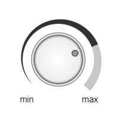

<a href="../readme.html">Home</a> → Segment Spiral Volume Control

***

# SegmentSpiralVolumeControl

## Contents
1. [Object description](#description)  
2. [Object dependencies](#dependencies)
3. [Object creation](#constructor)  
4. [Examples] (#examples)  
5. [Properties](#properties)  
6. [Methods](#methods)  
7. [Events](#events)  

##Object description  

Volume Control is a graphical control for changing the volume or some other value (Fig. 1).  

  
Fig. 1 - Volume control with spiral indicator  

##Object dependencies  
The following scripts should be included in the \<head> section:  

* segment.js  
* segment-spiral.js  
* segment-dot.js  
* segment-scale-mark.js  
* segment-knob.js  
* segment-gradient.js  
* utilities.js  

##Object creation  
To create an object, the main parameters are passed to the constructor function:  
>
*id* - volume control identificator as a text string.  
*context* - CanvasRenderingContext2D for drawing a volume control.  
*cx* - X coordinate of the indicator center.  
*cy* - Y coordinate of the indicator center.  
*r_in* - indicator inner radius.  
*thickness* - thickness of the indicator.  
*init_angle* - the initial angle of the indicator in degrees. May take negative values.  
*angle* - angle of the indicator in degrees.  

The outer radius of the indicator *r_out* will be calculated automatically during the creation of the object.  

##Examples  
<a href="../examples/round-volume-control-examples.html" target="_blank">Examples</a> of using various properties and methods of the object.  

##Properties
>
*min_value* - minimum value of changing parameter.   
*max_value* - maximum value of changing parameter.  
*value* - current value of changing parameter.  
*speed* - speed of change of the value when it is programmatically changed. 
>

SegmentSpiralVolumeControl is a composite object. It includes:  
>
*knob* - <a href="segment-knob.html">SegmentKnob</a>.  
*base_spiral* - base <a href="segment-spiral.html">SegmentSpiral</a> of indicator.  
*active_spiral* - active <a href="segment-spiral.html">SegmentSpiral</a> of indicator.  

### Base Spiral Style  
>
*base_spiral_gradient* - градиент заливки типа <a href="segment-gradient.html">SegmentGradient</a>.  
*base_spiral_background* - цвет заливки (применяется, если не задан градиент заливки).  
*base_spiral_border_width* - толщина границ.  
*base_spiral_border_color* - цвет границ.  

### Active Spiral Style  
>
*active_spiral_gradient* - градиент заливки типа <a href="segment-gradient.html">SegmentGradient</a>.  
*active_spiral_background* - цвет заливки (применяется, если не задан градиент заливки).  
*active_spiral_border_width* - толщина границ.  
*active_spiral_border_color* - цвет границ.  

### Volume Control Labels Style  
Label of the limit position of the knob corresponding to the minimum value of the changing parameter  
>
*min_text* - label text.  
*min_font* - text font.  
*min_color* - text color.  
*min_border_width* - text border width.  
*min_border_color* - text border color.    
*min_init_x* - initial X coordinate of the label.  
*min_init_y* - initial Y coordinate of the label.  
*min_offset_x* - X offset of the label.  
*min_offset_y* - Y offset of the label.   

Label of the limit position of the knob corresponding to the maximum value of the changing parameter  
>
*max_text* - label text.  
*max_font* - text font.  
*max_color* - text color.  
*max_border_width* - text border width.  
*max_border_color* - text border color.    
*max_init_x* - initial X coordinate of the label.    
*max_init_y* - initial Y coordinate of the label.  
*max_offset_x* - X offset of the label.  
*max_offset_y* - Y offset of the label.  

### Object Flags  
>
*visible* - value *true* ensures object visibility.  
*in_progress* - flag takes the value *true* during the animation.  

##Methods  

> *build()* - performs basic calculations of the shape and style of object, taking into account the specified properties and flags.  

> *calcLabels()* - determines the initial position of the captions depending on the parameters of the base segment of the indicator.  

> *draw()* - draws an object.  

> *instanceCopy()* - creates an independent copy of the object.  

> *angleToValue(angle)* - function of calculating the value of the changing parameter depending on the angle of rotation of the knob.  

> *valueToAngle(value)* - function of calculating the angle of the active spiral of the indicator depending on the current value of the changing parameter.  

> *valueToThickness(value)* - function of calculating the thickness of the active spiral of the indicator depending on the current value of the changing parameter.  

> *setValue(value)* - function of setting the current value of the changing parameter.  

> *changeValue(value, speed, delay)* - animation of changing the current value to *value* with *speed* after *delay*.  

> *catchKnob(e)* - grabbing the knob by left clicking on it.  
>>
The method is set as a listener for the *mousedown* event on the canvas.  

> *rotateKnobByMouseMovement(e)* - rotating the grabbed knob by mouse move.  
>>
The method is set as a listener for the *mousemove* event on the canvas.  

> *rotateKnobByMouseWheel(e)* - rotating the grabbed knob by mouse wheel.  
>>
The method is set as a listener for the *wheel* event on the canvas.  

> *releaseKnob()* - the grabbed knob is released by releasing the left mouse button.  
>>
The method is set as a listeners for the *mouseup* and *mouseout* events on the canvas.  

> *removeKnotListeners()* - removal of the canvas event listeners of the same name emanating from the child object of the *SegmentKnob* type.  
>>
The method must be called every time after executing the *build()* method of a child object of type *SegmentKnob*.  

##Events  

Events triggered by a SegmentSpiralVolumeControl are implemented using a CustomEvent.  
In the *detail.volume_control* field, a link to the object itself is passed.  

> *segment-spiral-volume-control-changed* - state of the object is changed.  

***

<a href="../readme.html">Home</a> → Segment Spiral Volume Control  