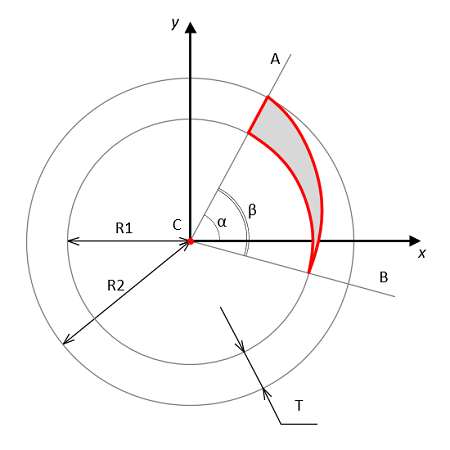

<a href="../readme.html">Home</a> → Segment Spiral  

***

# SegmentSpiral

## Contents
1. [Object description](#description)  
2. [Object dependencies](#dependencies)
3. [Object creation](#constructor)  
4. [Examples] (#examples)  
5. [Properties](#properties)  
6. [Methods](#methods)  
7. [Events](#events)  

##Object description

Segment spiral is a part of a ring segment, limited by a circle and a spiral, having a common center, as well as a ray emanating from this center (Fig. 1).  

  
Fig. 1 - Segment Spiral Geometry  

C - segment spiral center - this is the center of the base segment.  
R1 - radius of the smaller circle.  
R2 - radius of the larger circle.  
CA - ray, bounding the base segment and determining its beginning.  
CB - ray, bounding the base segment and determining its ending.  
T - thickness of the base segment equal to the difference between R2 and R1.  
α - initial angle of the base segment - this is the angle between the horizontal axis X and the ray CA.  
β - angle of the base segment - this is the angle between the rays CA and CB.  

##Object dependencies  
The following scripts should be included in the \<head> section:  

* segment-gradient.js  
* utilities.js  

##Object creation  
To create an object, the main parameters are passed to the constructor function:   
>
*id* - segment spiral identificator as a text string.  
*context* - CanvasRenderingContext2D for drawing the segment spiral.  
*cx* - X coordinate of the base segment center.  
*cy* - Y coordinate of the base segment center.  
*r_in* - base segment inner radius.  
*thickness* - thickness of the base segment.  
*init_angle* - the initial angle of the base segment in degrees. May take negative values.  
*angle* - angle of the base segment in degrees.  

The outer radius of the base segment *r_out* will be calculated automatically during the creation of the object.  

##Examples  
<a href="../examples/segment-spiral-examples.html" target="_blank">Examples</a> of using various properties and methods of the object.  

##Properties

### Параметры фигуры
>
*position* - the position of the figure in the base segment relative to the spiral side.  

>Valid *position* values:  
>> _"inner"_ - abutment to the inner boundary of the base segment.  
>> _"outer"_ - abutment to the outer boundary of the base segment.  

>
*direction* - direction of increasing figure thickness.  

>Valid *direction* values:  
>> _"clockwise"_.  
>> _"anticlockwise"_.

### Segment Spiral Style  
>
*gradient* - fill gradient. Type of value is <a href="segment-gradient.html">SegmentGradient</a>.  
*background* - fill color (applies if fill gradient is not specified).  
*border_width* - segment spiral border width.  
*border_color* - segment spiral border color.  

Segment spiral borders can be set separately.  

Types of segment spiral borders (Fig. 2)

A) Opening Border – first border when clockwise movement.  
Suitable for a spiral with an anticlockwise *direction*.  
> *border_opening_width* - width of the opening border.  
> *border_opening_color* - color of the opening border.  

B) Outer Border – segment arc with larger radius.  
Suitable for a spiral with an outer *position*.  
> *border_outer_width* - width of the outer border.    
> *border_outer_color* - color of the outer border.  

C) Inner Border – segment arc with smaller radius.  
Suitable for a spiral with an inner *position*.  
> *border_inner_width* - width of the inner border.    
> *border_inner_color* - color of the inner border.  

D) Closing Border – extreme border when clockwise movement.  
Suitable for a spiral with a clockwise *direction*.  
> *border_closing_width* - width of the closing border.    
> *border_closing_color* - color of the closing border.  

E) Spiral Borders – spiral side of a figure.  
> *border_spiral_width* - width of the spiral border.  
> *border_spiral_color* - color of the spiral border.  

If a separate spiral border width and/or color is specified, then the specified style will be used to draw it.  
If a separate spiral border is not specified, then the general style of segment border will be used to draw it.  

### Object Flags
>
*visible* - flag ensures the visibility of the object if set in *true*.  
*in_progress* - flag takes the value *true* during the animation.  

##Methods  

> *calc()* - performs basic calculations of the shape and style of a segment spiral when it is created, changed and during animation.  
This method should be called after changing the properties of the object so that they take effect.  

> *calcBorder()* -  computes segment spiral borders styles. Called automatically from *calc()* method.  

> *draw()* - draws an object.  

> *instanceCopy()* - creates an independent copy of the object.

### Segment Spiral Animation

Segment Spiral animation is various changes in the shape, position, or style of the segment over time.  

Key animation parameters:  
> *duration* - animation duration. Sets in seconds.  
> *delay* - delay before the start of the animation. Sets in seconds.  
> *direction* - animation direction. Valid values ​​depend on the type of animation.  

#### Animation Methods

> *appear(direction, duration, delay)* - the appearance of a segment due to a gradual change in its shape.  

> Valid values ​​for the *direction*:  
>> _"from-center"_ - from segment center.  
>> _"to-center"_ - to segment center.  
>> _"from-axis"_ - from segment axis.  
>> _"clockwise"_ - clockwise from the opening border.  
>> _"anticlockwise"_ - anticlockwise from the closing border.  

> *disappear(direction, duration, delay)* - the disappearance of a segment due to a gradual change in its shape.  

> Valid values ​​for the *direction*:  
>> _"from-center"_ - from segment center.  
>> _"from-outside"_ - to segment center.  
>> _"to-axis"_ - to segment axis.  
>> _"clockwise"_ - clockwise to the closing border.  
>> _"anticlockwise"_ - anticlockwise to the opening border.  

> *rotate(direction, angle, duration, delay)* - rotation of the segment by *angle* for *duration* seconds.  

> The *angle* of rotation is set in degrees.  

> Valid values ​​for the *direction*:  
>> _"clockwise"_ - clockwise rotation.  
>> _"anticlockwise"_ - anticlockwise rotation.  

> *fadeIn(duration, delay)* - gradual appearance of a segment due to a change in its transparency.  

> *fadeOut(duration, delay)* - gradual disappearance of a segment due to a change in its transparency.  

##Events  

Events triggered by a SegmentSpiral are implemented using a CustomEvent.  
In the *detail.spiral* field, a link to the object itself is passed.  

> *segment-spiral-changed* - event dispatches every time the *calc()* method is executed.  

> *segment-spiral-appeared*  
> *segment-spiral-disappeared*  
> *segment-spiral-rotated*  
> *segment-spiral-faded-in*  
> *segment-spiral-faded-out*  

***

<a href="../readme.html">Home</a> → Segment Spiral  