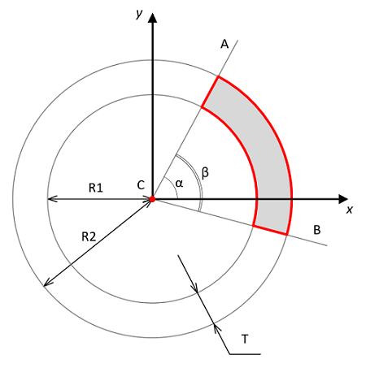
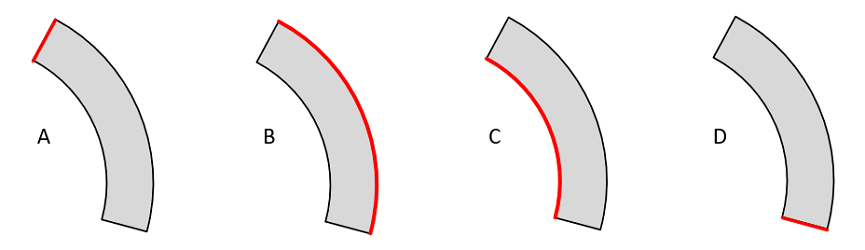

<a href="../readme.html">Home</a> → Segment  

***

# Segment

## Contents
1. [Object description](#description)  
2. [Object dependencies](#dependencies)
3. [Object creation](#constructor)  
4. [Examples] (#examples)  
5. [Properties](#properties)  
6. [Methods](#methods)  
7. [Events](#events)  

##Object description

Segment of ring  is part of a circle bounded by two circles of different radii with a common center and two rays emerging from this center (Fig. 1).  
  
Fig. 1 - Ring Segment Geometry

C - segment center - this is the center of the bounding circles and the beginning of the bounding rays.  
R1 - radius of the smaller circle.  
R2 - radius of the larger circle.  
CA - ray, bounding the ring segment and determining its beginning.  
CB - ray, bounding the ring segment and determining its ending.  
T - thickness of the segment equal to the difference between R2 and R1.  
α - initial angle of the segment - this is the angle between the horizontal axis X and the ray CA.  
β - angle of the segment - this is the angle between the rays CA and CB.  

##Object dependencies  
The following scripts should be included in the \<head> section:  

* segment-gradient.js  
* utilities.js  

##Object creation  
To create an object, the main parameters are passed to the constructor function:   
>
*id* - segment identificator as a text string.  
*context* - CanvasRenderingContext2D for drawing the segment.  
*cx* - X coordinate of the segment center.  
*cy* - Y coordinate of the segment center.  
*r_in* - segment inner radius.  
*thickness* - thickness of the segment.  
*init_angle* - the initial angle of the segment in degrees. May take negative values.  
*angle* - angle of the segment in degrees.  

The outer radius of the segment *r_out* will be calculated automatically during the creation of the object.  

The object will take the form of a ring if you set the *angle* of the segment to a multiple of 360 degrees.  
The object will take the form of a circle segment if the inner radius *r_in* is set to 0.  
The object will take the form of a circle if both of these conditions are met.  

##Examples  
<a href="../examples/segment-examples.html" target="_blank">Examples</a> of using various properties and methods of the object.  

##Properties

### Segment Style  
>
*gradient* - fill gradient. Type of value is <a href="segment-gradient.html">SegmentGradient</a>.  
  
>Valid *direction* values for a Linear Gradient:  
>> _"from-center"_ - from segment center.  
>> _"to-center"_ - to segment center.  
>> _"from-opening"_ - from the opening border to the closing border along the chord of larger circle.  
>> _"from-closing"_ - from the closing border to the opening border along the chord of larger circle.  

>Valid *direction* values for a Radial Gradient:  
>> _"from-center"_ - from segment center.  
>> _"to-center"_ - to segment center.  

>Valid *direction* values for a Conic Gradient:  
>> _"clockwise"_.  
>> _"anticlockwise"_.  

>
*background* - fill color (applies if fill gradient is not specified).  
*border_width* - segment border width.  
*border_color* - segment border color.

Segment borders can be set separately.  

Types of segment borders (Fig. 2)

A) Opening Border – first border when clockwise movement.  
> *border_opening_width* - width of the opening border.    
> *border_opening_color* - color of the opening border.  

B) Outer Border – segment arc with larger radius.  
> *border_outer_width* - width of the outer border.    
> *border_outer_color* - color of the outer border.  

C) Inner Border – segment arc with smaller radius.  
> *border_inner_width* - width of the inner border.    
> *border_inner_color* - color of the inner border.  

D) Closing Border – extreme border when clockwise movement.  
> *border_closing_width* - width of the closing border.    
> *border_closing_color* - color of the closing border.  

  
Рис. 2 - Ring Segment Borders  

If a separate segment border width and/or color is specified, then the specified style will be used to draw it.  
If a separate border is not specified, then the general style of segment border will be used to draw it.  

### Object Flags
>
*visible* - flag ensures the visibility of the object if set in *true*.  
*in_progress* - flag takes the value *true* during the animation.  

##Methods

> *calc()* - performs basic calculations of the shape and style of a segment when it is created, changed and during animation.  
This method should be called after changing the properties of the object so that they take effect.  

> *calcBorder()* -  computes segment borders styles. Called automatically from *calc()* method.  

> *draw()* - draws an object.  

> *instanceCopy()* - creates an independent copy of the object.  

> *isPointInside(x, y)* - function for checking whether a point with coordinates (x,y) belongs to a figure.  

### Segment Animation

Segment animation is various changes in the shape, position, or style of the segment over time.  

Key animation parameters:  
> *duration* - animation duration. Sets in seconds.  
> *delay* - delay before the start of the animation. Sets in seconds.  
> *direction* - animation direction. Valid values ​​depend on the type of animation.  

#### Animation Methods

> *appear(direction, duration, delay)* - the appearance of a segment due to a gradual change in its shape.  

> Valid values ​​for the *direction*:  
>> _"from-center"_ - from segment center.  
>> _"to-center"_ - to segment center.  
>> _"from-axis"_ - from segment axis.  
>> _"clockwise"_ - clockwise from the opening border.  
>> _"anticlockwise"_ - anticlockwise from the closing border.  

> *disappear(direction, duration, delay)* - the disappearance of a segment due to a gradual change in its shape.  

> Valid values ​​for the *direction*:  
>> _"from-center"_ - from segment center.  
>> _"from-outside"_ - to segment center.  
>> _"to-axis"_ - to segment axis.  
>> _"clockwise"_ - clockwise to the closing border.  
>> _"anticlockwise"_ - anticlockwise to the opening border.  

> *rotate(direction, angle, duration, delay)* - rotation of the segment by *angle* for *duration* seconds.  

> The *angle* of rotation is set in degrees.  

> Valid values ​​for the *direction*:  
>> _"clockwise"_ - clockwise rotation.  
>> _"anticlockwise"_ - anticlockwise rotation.  

> *fadeIn(duration, delay)* - gradual appearance of a segment due to a change in its transparency.  

> *fadeOut(duration, delay)* - gradual disappearance of a segment due to a change in its transparency.  

##Events

Events triggered by a Segment are implemented using a CustomEvent.  
In the *detail.segment* field, a link to the object itself is passed.  

> *segment-changed* - event dispatches every time the *calc()* method is executed.  

> *segment-appeared*  
> *segment-disappeared*  
> *segment-rotated*  
> *segment-faded-in*  
> *segment-faded-out*  

***

<a href="../readme.html">Home</a> → Segment  